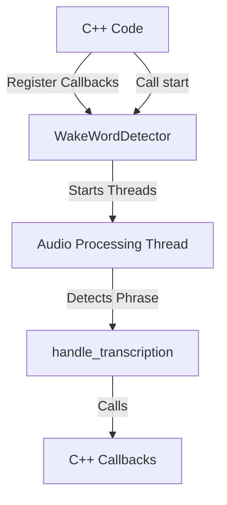
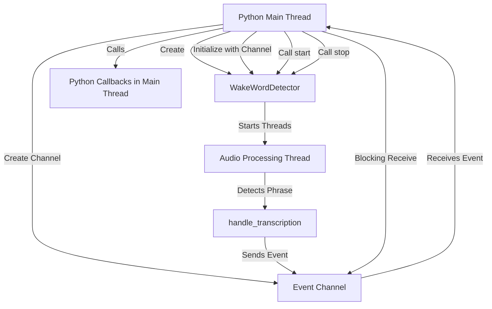

# Python PyBind11 Module - Refactored Architecture

## Overview

Refactor the C++ architecture to support Python control. Key changes:

1. **Remove stdin blocking** - `start()` becomes non-blocking
2. **Add direct callback support** - For C++ use cases, callbacks called where events are detected
3. **Event channel pattern for Python** - Python uses event channel and runs event loop in main thread (avoids GIL issues)
4. **Make event channel optional** - Detector works with callbacks, channel, or both
5. **Python controls lifecycle** - Python calls start/stop, receives callbacks via event loop

## Architecture

### For C++ (Direct Callbacks)


### For Python (Event Channel Pattern)


## Why Event Channel for Python?

**Problem with calling Python callbacks from C++ thread:**
1. **GIL required** - Must acquire/release GIL for each callback (overhead)
2. **Blocks audio processing** - Slow Python callbacks delay audio chunk processing
3. **Thread safety** - C++ thread isn't a Python thread, complex GIL management

**Solution: Event Channel Pattern**
- Detector sends events to channel (fast, no GIL needed)
- Python runs event loop in **main thread** (no GIL issues)
- Python callbacks execute in main thread (natural Python execution)
- No blocking of audio processing thread
- Clean separation of concerns

## Key Architectural Changes

### 1. Callback Support in WakeWordDetector (for C++)

**Current**: Events sent to channel, handled in separate event loop

**New**: 
- Callbacks called directly in `handle_transcription()` where events are detected (for C++ use)
- Event channel still available (for Python use)
- Can use callbacks, channel, or both

### 2. Non-Blocking start() Method

**Current**: `start()` blocks on `std::cin.get()` waiting for user input

**New**: `start()` starts threads and returns immediately

- Remove `std::cin.get()` from line 240
- Remove automatic `stop()` call after stdin
- Method just starts background threads and returns 0
- Python controls when to call `stop()`

### 3. Optional Event Channel

**Current**: Event channel required for initialization

**New**: Event channel optional, callbacks can be used instead

- Modify `initialize()` to make event_channel optional (can be nullptr)
- Detector works with:
  - Just callbacks (no channel) - C++ use case
  - Just channel (no callbacks) - Python use case
  - Both (callbacks + channel) - Flexible
- Backward compatible with existing C++ code

### 4. Python Lifecycle Control

**Flow**:

1. Python creates `WakeWordDetector` instance
2. Python creates `Channel<WakeWordEvent>` (or wrapper creates it)
3. Python calls `initialize(config, event_channel)` - channel required for Python
4. Python registers callbacks (stored in Python wrapper, not C++ detector)
5. Python calls `start()` - returns immediately, threads running in background
6. Python runs event loop in main thread (blocking receive from channel)
7. When event received, Python calls its callbacks in main thread
8. Python calls `stop()` when done - stops threads cleanly
9. Python calls `cleanup()` to free resources

## Implementation Steps

### 1. Add Callback Support to WakeWordDetector Class (for C++)

- Modify [include/wake_word_detector.hpp](include/wake_word_detector.hpp):
  - Add `std::function<void(const WakeWordEvent&)> start_callback_` member
  - Add `std::function<void(const WakeWordEvent&)> stop_callback_` member
  - Add `register_start_callback(std::function<void(const WakeWordEvent&)> callback)` method
  - Add `register_stop_callback(std::function<void(const WakeWordEvent&)> callback)` method
  - Make `event_channel` parameter optional in `initialize()` (can be nullptr)

- Modify [src/wake_word_detector.cpp](src/wake_word_detector.cpp):
  - Store callbacks in class members
  - In `handle_transcription()` (lines 138-149):
    - When START detected: call `start_callback_` if set (wrap in try-catch)
    - When STOP detected: call `stop_callback_` if set (wrap in try-catch)
    - Also send to event_channel if set (for Python and backward compatibility)
  - Make `event_channel_` nullable (use `Channel<WakeWordEvent>*` with nullptr check)

### 2. Remove Blocking Input

- Modify [src/wake_word_detector.cpp](src/wake_word_detector.cpp):
  - Remove `std::cin.get()` from `start()` method (line 240)
  - Remove `stop()` call that follows it (line 243)
  - `start()` should:
    1. Check if initialized
    2. Setup audio device
    3. Start chunk processing thread
    4. Return 0 immediately
  - Python will call `stop()` separately when needed

### 3. Add PyBind11 Dependency

- Add PyBind11 to [CMakeLists.txt](CMakeLists.txt) using FetchContent
- PyBind11 can be fetched from GitHub or installed via pip/brew

### 4. Create Python Bindings with Event Channel Pattern

- Create `src/python_bindings.cpp`:
  - Expose `Config` struct with all fields
  - Expose `WakeWordEvent` struct and `WakeWordEventType` enum
  - Expose `Channel<WakeWordEvent>` class (for Python to create channels)
  - Expose `WakeWordDetector` class with:
    - `initialize(config, event_channel)` - channel required for Python pattern
    - `start()` - non-blocking, returns immediately
    - `stop()` - stops detection
    - `cleanup()` - cleanup resources
  - Create Python wrapper class `WakeWordDetectorPython` that:
    - Manages event channel internally
    - Has `register_start_callback()` and `register_stop_callback()` methods
    - Has `start()` method that:
      1. Creates channel
      2. Initializes detector with channel
      3. Starts detector
      4. Runs event loop in Python thread (blocking receive)
      5. Calls Python callbacks when events received
    - Callbacks stored in Python wrapper, called from Python main thread (no GIL issues)

### 5. Exception Handling

- Wrap callback invocations in try-catch (for C++ callbacks):
  ```cpp
  try {
      if (start_callback_) {
          start_callback_(event);
      }
  } catch (const std::exception& e) {
      // Log error, don't crash
      std::cerr << "Error in start callback: " << e.what() << std::endl;
  }
  ```
- Python callbacks don't need try-catch in C++ - they're called from Python thread

### 6. Update CMakeLists.txt

- Add PyBind11 via FetchContent
- Add Python module target (shared library)
- Set module name to `voice_recorder`
- Link against existing libraries (SDL2, whisper, etc.)

### 7. Create Python Example

- Create `examples/python_example.py`:
  - Show Python-controlled lifecycle
  - Demonstrate callback registration
  - Show event loop running in Python main thread
  - Show how to stop from signal handler

## Key Files to Modify/Create

1. **[include/wake_word_detector.hpp](include/wake_word_detector.hpp)**: 
   - Add callback members and registration methods
   - Make event_channel optional in initialize()

2. **[src/wake_word_detector.cpp](src/wake_word_detector.cpp)**:
   - Remove `std::cin.get()` from `start()` (line 240)
   - Add callback invocation in `handle_transcription()` (lines 138-149)
   - Make event_channel optional

3. **[src/main.cpp](src/main.cpp)**: May need update if using start_wake_word_detection()

4. **src/python_bindings.cpp**: New file with PyBind11 bindings and Python wrapper class

5. **[CMakeLists.txt](CMakeLists.txt)**: Add PyBind11 and Python module

6. **examples/python_example.py**: Example usage

## Technical Details

### Event Channel Pattern for Python

**Why this works:**
- Detector sends events to channel (fast, no GIL, no blocking)
- Python receives events in main thread via blocking `receive()`
- Python callbacks execute in main thread (natural Python execution)
- No GIL acquisition needed (Python already has GIL in main thread)
- No blocking of audio processing thread

**Python Wrapper Implementation:**
```cpp
class WakeWordDetectorPython {
private:
    WakeWordDetector detector_;
    Channel<WakeWordEvent> event_channel_;
    pybind11::object start_callback_;
    pybind11::object stop_callback_;
    std::thread event_loop_thread_;
    
public:
    void register_start_callback(pybind11::object callback) {
        start_callback_ = callback;
    }
    
    void start(const Config& config) {
        // Initialize with channel
        detector_.initialize(config, event_channel_);
        
        // Start detector (non-blocking)
        detector_.start();
        
        // Run event loop in Python thread (blocking)
        run_event_loop();
    }
    
    void run_event_loop() {
        while (!event_channel_.is_closed()) {
            WakeWordEvent event = event_channel_.receive();
            if (event_channel_.is_closed()) break;
            
            // Call Python callbacks in main thread (no GIL issues)
            if (event.type == WakeWordEventType::START && start_callback_) {
                start_callback_(event);
            } else if (event.type == WakeWordEventType::STOP && stop_callback_) {
                stop_callback_(event);
            }
        }
    }
};
```

### Thread Safety

- Event channel is thread-safe (uses mutex/condition_variable internally)
- Python callbacks called from Python main thread (no thread safety issues)
- Detector thread just sends events (fast, non-blocking)

### Event Flow

1. Audio chunk transcribed in `process_audio_chunks()` thread
2. `handle_transcription()` called with transcription
3. Phrase detection occurs (START or STOP)
4. Event sent to channel (fast, non-blocking)
5. Python main thread blocks on `event_channel.receive()`
6. Event received in Python main thread
7. Python callback called in main thread (no GIL issues)
8. Detection continues in background

## Python API Design

```python
import voice_recorder
import signal

# Create config
config = voice_recorder.Config()
config.model_path = "/path/to/model.bin"
config.start_phrase = "hey alfred"
config.stop_phrase = "stop alfred"

# Create detector (wrapper manages channel internally)
detector = voice_recorder.WakeWordDetectorPython()

# Register callbacks (called from Python main thread)
def on_start(event):
    print(f"START detected: {event.transcription}")
    # Python code can respond here - no GIL issues!

def on_stop(event):
    print(f"STOP detected: {event.transcription}")
    # Python code can respond here

detector.register_start_callback(on_start)
detector.register_stop_callback(on_stop)

# Start detection (blocks in event loop, callbacks called from main thread)
# Can stop from signal handler
def signal_handler(sig, frame):
    detector.stop()
    detector.cleanup()
    exit(0)

signal.signal(signal.SIGINT, signal_handler)

detector.start(config)  # Blocks here, running event loop
```

## Benefits of This Architecture

1. **No GIL issues** - Python callbacks run in main thread
2. **No blocking of audio processing** - Events sent to channel, processed asynchronously
3. **Clean separation** - Detector doesn't know about Python, just sends events
4. **Flexible** - Can use callbacks (C++), channel (Python), or both
5. **No stdin dependency** - Works in any environment
6. **Python controls lifecycle** - Start/stop from Python, no blocking
7. **Backward compatible** - Existing C++ code can still use callbacks directly

## Build Instructions

- Install PyBind11: `pip install pybind11` (for headers) or use FetchContent
- Build: `cmake ..` then `cmake --build .`
- Python module will be in build directory (e.g., `voice_recorder.cpython-*.so` on Linux/Mac)
- Add build directory to PYTHONPATH or install to site-packages

